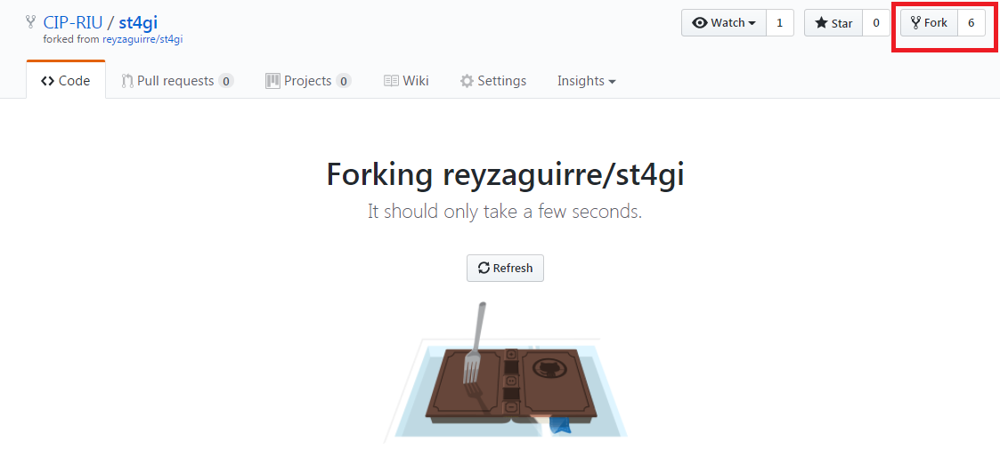
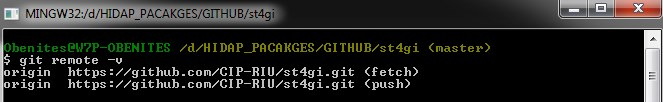
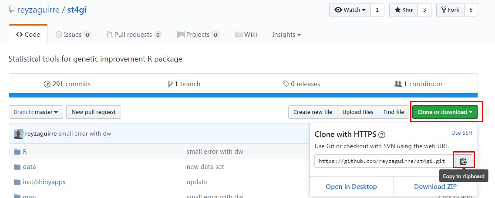
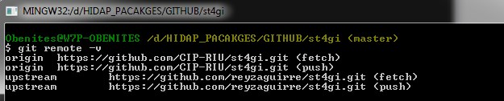
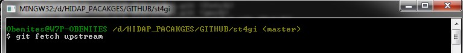

# Git tutorial for maintenance of RIU repositories.


## 1 Introduction

This tutorial provides an easy introduction to use **Git** and **GitHub** for repository maintenance. For this reason, to follow this guide you should have Git software installed in your machine and a GitHub account. In case of not having them, you can see the links below:

- https://git-scm.com/

- https://github.com/
 
## 2 Fork repositories from GitHub

One of the basic steps is *fork* packages. Our collaborators from other units at CIP commonly use packages together with Github to work with riu projects. A *Fork* is a copy of a particular repository. When you *fork* a package you preserve the original one and make changes in your copy. 

For this purpose, we need

- Go to a particular repository that you want to copy. For example st4gi repository of Raul Eyzaguirre: https://github.com/reyzaguirre/st4gi

- Click on the *fork* button which appear in the right corner.

- Finally, you have a copy of the original repository: https://github.com/CIP-RIU/st4gi 


<!--  -->


## 3 Update your fork repositiroy

Frequently, to work with the lastest commits from the original repository, we should be updating our *forks*. For this reason, we are going to give some useful git commands to trace and update new changes. 

Note: We asssume that you have al the previous requirements.

### 3.1 Remote

- First, check where is your git repository. Open git (bash) and then type:

``` 
$ git remote -v
```
<!--  -->

### 3.2 Upstream

- Secondly, we need the original (origin) repository, so we look for, in this case is https://github.com/reyzaguirre/st4gi. Then go to *clone or download* and then click on the clipboard to copy the https link. 


<!--  -->

The https links is https://github.com/reyzaguirre/st4gi.git. Now go to git console and type:

```
$ git remote add upstream https://github.com/reyzaguirre/st4gi.git
$ git remote -v
```

What we basically do here is setting up the origin repository (our copy) and the *upstream* repository, which is the st4gi reyzaguire's repository which has new features that we want to merge in our repository.

<!--  -->


### 3.3 Fetch and Merge

To track all the modifcations that upstream repository (st4gi) has, we use the *fetch* command in git:

```
$ git fetch upstream
```
<!--  -->

After tracking new changes from the upstream repository, now we *merge* all of them in our origin repository. In the git console type: 


```
$ git merge upstream/master
```

<!--  -->


### 3.4 Push to GitHub

Eventually to push your changes into GitHub, you need to type the following lines in git:

```
$ git push origin to master
```
Note: In case of asking for credentials, write them in the console. 

Thats all!. Now you can go to your GitHub repository and see the new additions.


